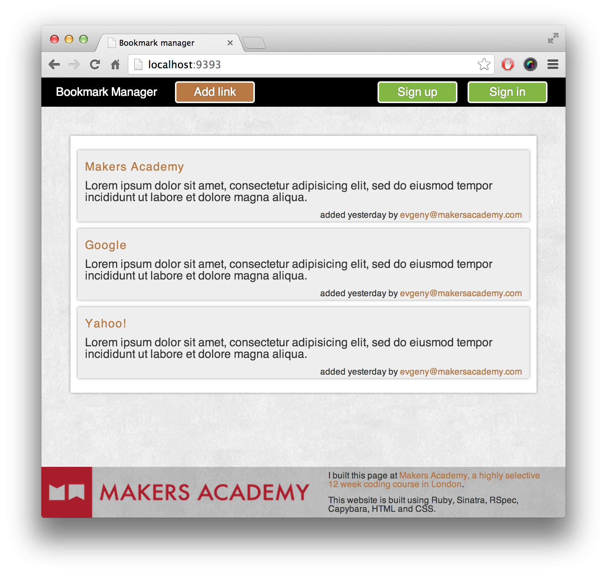

# Bookmark_manager
The project
=================
------> Learning Objectives: Generate User Stories from Requirements<---------

-- Project Image: --

* To run project => rackup
* To install dependencies => bundle

To set-up Database:
=====================
* Database used => postgreSQL 
(list all database = postgres=# \l)
(quit psql = postgres=# \q  )

- Connect to psql
- Create the database using the psql command CREATE DATABASE bookmark_manager;
- Connect to the database using the pqsl command \c bookmark_manager;
- Run the query saved in the file 01_create_bookmarks_table.sql

- You can use it to: 
-------------------------
  1. save a webpage you found useful. 
  2. add tags to the webpages you saved to find them later
  3. browse bookmarks other users have added. 
  4. comment on the bookmarks.

USER STORY:
================
WEBSITE SPECIFICATIONS: 
- Show a list of bookmarks
- Add new bookmarks
- Delete bookmarks
- Update bookmarks
- Comment on bookmarks
- Tag bookmarks into categories
- Filter bookmarks by tag
- Users are restricted to manage only their own bookmarks

user stories:
=================== 
1.
#As a bookmark manager,
#So that I manage my bookmarks,
#I'd like to be shown a list of bookmarks.

2.
#As a time-pressed user
#So that I can quickly go to web sites I regularly visit
#I would like to add the site's address and title to bookmark manager
